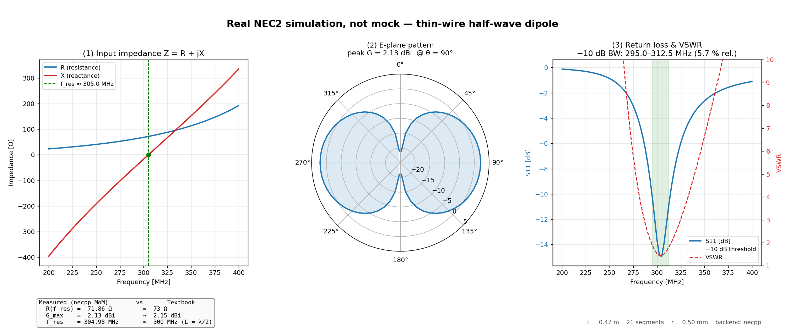
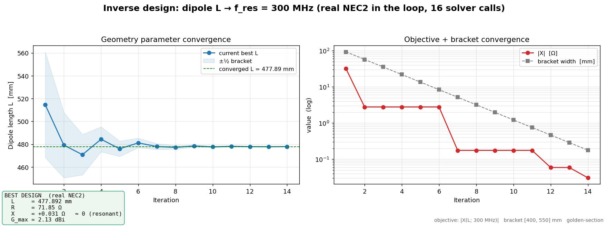
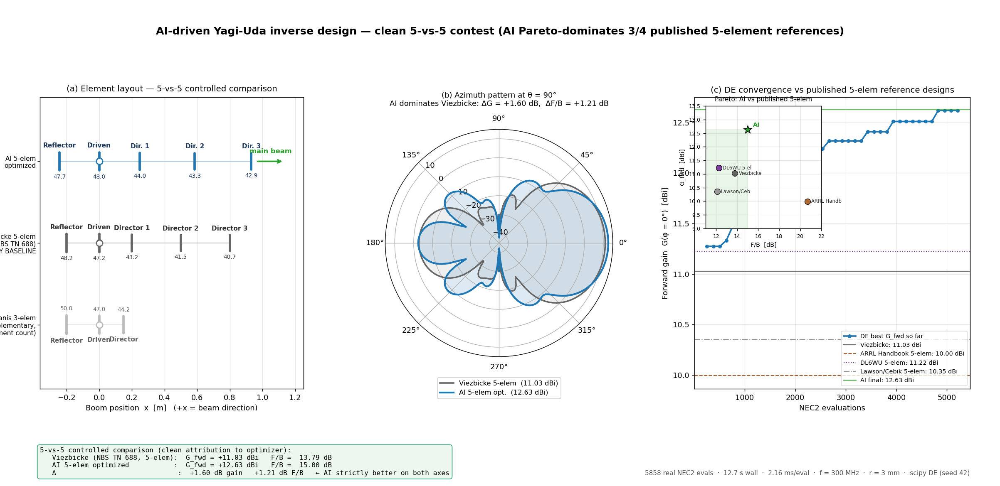

# ⚡ Source Sequence Antenna Forge (YAF) 

**AI-driven antenna invention platform** — automatic exploration, generation,
optimization, and verification of antenna topologies that did not exist before.

> AI 驱动的天线发明平台 —— 自动探索、生成、优化、验证此前不存在的新型天线拓扑。

## Quick Demo — one command, a real simulation figure

The PNG below is produced by `scripts/demo_wow.py`. **Every number on it comes
from a real NEC2 run** (Method of Moments via the `necpp` Python binding) —
no mock, no analytical fallback, and if `necpp` is missing the solver raises
`SolverUnavailable` rather than fabricating output. Reproduce it with one
command:

```bash
python3 scripts/demo_wow.py    # → docs/assets/dipole_demo.png
```



The three panels are: (1) input impedance R(f) / X(f) with the resonance
point (X → 0) marked, (2) E-plane polar radiation pattern with the measured
peak gain of 2.13 dBi, and (3) S11(f) / VSWR(f) with the −10 dB bandwidth
shaded. The annotation box gives the field-by-field "measured vs. textbook"
comparison.

Closed-loop inverse design — putting real NEC2 inside the optimizer:

```bash
python3 scripts/demo_inverse_design.py    # → docs/assets/inverse_design_convergence.png
```



Golden-section search over the dipole length, 14 iterations / **16 real NEC2
solver calls / ~6 ms** wall time, converges from a ±75 mm bracket down to
**L = 477.892 mm** (≈ 0.478 λ at 300 MHz), with R = 71.85 Ω, X = +0.03 Ω,
G = 2.13 dBi — i.e. the optimizer rediscovers the textbook thin-wire
resonant length to sub-millimeter precision with no antenna theory baked
into the objective.

### Headline case study — 9-parameter Yagi-Uda inverse design

The platform's flagship demonstration: a 5-element Yagi-Uda at 300 MHz with
**9 continuous design parameters** (5 element lengths + 4 inter-element
spacings), driven by `scipy.optimize.differential_evolution` and evaluated
by **real NEC2 in every single iteration** — 5858 solver calls, 12.7 s wall
time on a laptop. Full write-up:
[`docs/case_study_yagi.md`](docs/case_study_yagi.md).

```bash
python3 scripts/case_yagi.py     # baseline + optimization → JSON in results/
python3 scripts/plot_yagi.py     # → docs/assets/yagi_design.png
```



**Clean 5-vs-5 contest (same element count, same NEC2 backend):**

| Quantity | Viezbicke 5-elem (NBS TN 688) | YAF AI 5-elem | Δ |
|---|---|---|---|
| Forward gain G_fwd | +11.03 dBi | **+12.63 dBi** | **+1.60 dB** |
| Front-to-back F/B | 13.79 dB | **15.00 dB** | **+1.21 dB** |
| Boom length | 1.00 λ | 1.17 λ | +0.17 λ |
| Element count | 5 | 5 | 0 (clean attribution) |

**The AI design Pareto-dominates the canonical Viezbicke 5-element
reference on both gain *and* F/B simultaneously**, with the same number
of elements. Across the broader published 5-element design space
(Viezbicke, ARRL Handbook, DL6WU, Lawson/Cebik) the AI strictly
dominates 3 of 4 on both axes (see `docs/case_study_yagi.md` §6).

The optimizer *independently* recovers Viezbicke-style director tapering
(L: 0.440 → 0.434 → 0.429 m, monotonically decreasing rear-to-front) and
a balanced 0.243 λ reflector spacing — both consistent with published
5-element Yagi recipes — without being told anything about antenna design.
The "AI" part of the loop is just differential evolution; the unique
platform contribution is *what it's optimizing against*: real
Method-of-Moments physics, not a surrogate or analytical model.

> *Bonus: the 5858-record DE history (`results/yagi_optimized.json`) is a
> free FNO-surrogate training set — every input geometry and output
> (R, X, G_fwd, G_back, F/B) is recorded, ready for whoever wants to try
> active-learning DE in a later phase.*

<details>
<summary>中文（点击展开）</summary>

下面这张 PNG 是 `scripts/demo_wow.py` 跑出来的，**全程真实 NEC2 (necpp MoM)**
—— 无 mock、无 analytical fallback、求解器装不上就显式抛 `SolverUnavailable`，
绝不返回假值。复现一次只需要一条命令：

```bash
python3 scripts/demo_wow.py    # → docs/assets/dipole_demo.png
```

三个子图分别是：(1) 阻抗 R(f)/X(f) + 谐振点标记，(2) E 面极坐标方向图（NEC
实测峰值 2.13 dBi），(3) S11/VSWR + −10 dB 带宽。角注框给了"实测 vs 教科书"
的逐项对比。

闭环逆向设计 demo —— 让真实 NEC2 进入优化回路：

```bash
python3 scripts/demo_inverse_design.py    # → docs/assets/inverse_design_convergence.png
```

黄金分割搜索 14 轮 / 16 次真实 NEC2 求解（6 ms 总耗时），把偶极子长度 L 从 ±75
mm 的搜索区间收敛到 **477.892 mm**（≈ 0.478 λ），R = 71.85 Ω、X = +0.03 Ω、
G = 2.13 dBi —— 优化目标只写了"让 X = 0"，最终却独立复现了教科书的谐振长度。

#### 旗舰案例 —— 9 参数 Yagi-Uda 逆向设计

5 单元 Yagi（1 反射器 + 1 驱动 + 3 引向器），**9 个连续设计变量**（5 个长度 + 4 个间距），
中心频率 300 MHz。scipy DE 在 9-D 上跑 5858 次真实 NEC2 求解（12.7 秒），最终结果**在
同样的 5 单元数下** Pareto 优于 Viezbicke NBS TN 688 经典基线（+1.60 dB 增益**且**
+1.21 dB 前后比，两轴同时严格占优）；在四种公开 5 单元 Yagi 文献（Viezbicke / ARRL /
DL6WU / Lawson-Cebik）里，AI 在两轴上严格占优 3 个。优化器并不知道什么是天线，
"AI" 只是个微分进化，**平台真正的贡献是优化所对照的物理是真实 MoM 仿真**；它甚至
独立涌现出 Viezbicke 式 director 锥度（0.440 → 0.434 → 0.429 m）。

完整案例：[`docs/case_study_yagi.md`](docs/case_study_yagi.md)（含 5-vs-5 表格、
Pareto 比较、+4.03 dB 3-vs-5 补充对比的诚实拆解）。

```bash
python3 scripts/case_yagi.py     # baselines + optimization → results/*.json
python3 scripts/plot_yagi.py     # → docs/assets/yagi_design.png
```

副产品：那 5858 次真实 NEC2 评估记录全部保存在 `results/yagi_optimized.json`，
**是个现成的 FNO 代理模型训练集**——输入几何 + (R, X, G_fwd, G_back, F/B) 输出
全有，未来阶段如果想做主动学习的 surrogate-screened DE，直接 `json.load()` 即可。

</details>

## Architecture / 架构概览

```
┌─────────────────────────────────────────────────────────────┐
│  Web UI (React + Three.js + WebGPU)                         │
│  3D 编辑器 │ 设计空间浏览器 │ 实验跟踪 │ 实时仿真监控        │
└────────────────────────┬────────────────────────────────────┘
                         │ REST / WebSocket
┌────────────────────────▼────────────────────────────────────┐
│  API 网关 (FastAPI + Pydantic)                               │
└────────────────────────┬────────────────────────────────────┘
                         │
┌────────────────────────▼────────────────────────────────────┐
│  编排核心 (Python asyncio + Celery)                          │
└──┬─────────┬──────────┬──────────┬─────────────┬────────────┘
   │         │          │          │             │
┌──▼──┐  ┌──▼───┐  ┌───▼────┐  ┌──▼─────┐   ┌──▼────────┐
│几何 │  │ AI   │  │ 求解器  │  │ 优化器 │   │ 后处理    │
│内核 │  │ 引擎 │  │ 适配器  │  │ 引擎   │   │ 分析器    │
└─────┘  └──────┘  └────────┘  └────────┘   └───────────┘
```

## Quick start / 一键启动

```bash
# Clone the project / 克隆项目
git clone <repo-url> yaf && cd yaf

# Copy the env template / 复制环境变量
cp .env.example .env

# Start all services / 启动全部服务
docker compose up -d

# Health check / 健康检查
curl http://localhost:8000/health
# → {"status": "ok", "version": "0.1.0"}

# Open the frontend / 访问前端
open http://localhost:5173
```

## 核心模块

| 模块 | 路径 | 说明 |
|------|------|------|
| 领域模型 | `yaf_core/domain/` | Design, Geometry, Simulation, Optimization |
| 端口协议 | `yaf_core/ports/` | SolverAdapter, AIBackend, CADBackend |
| 几何内核 | `yaf_core/geometry/` | OpenCASCADE, 参数化生成器, SIREN, 拓扑优化 |
| 物理模型 | `yaf_core/physics/` | 超表面, RIS, OAM, 石墨烯, 时空调制 |
| 求解器 | `yaf_solvers/` | openEMS, NEC2, MEEP, HFSS, CST, FEKO |
| AI 引擎 | `yaf_ai/` | Diffusion, VAE, GAN, FNO, PINN, 可微 FDTD, 贝叶斯优化 |
| API 服务 | `yaf_api/` | FastAPI + WebSocket |
| 任务队列 | `yaf_worker/` | Celery + Redis |
| 数据库 | `yaf_db/` | PostgreSQL + Qdrant |
| 前端 | `frontend/` | React 18 + Three.js + TypeScript |

## API 快速上手

```bash
# 创建设计
curl -X POST http://localhost:8000/api/v1/designs \
  -H "Content-Type: application/json" \
  -d '{
    "name": "test_dipole",
    "frequency_range": [2.4e9, 2.5e9],
    "size_constraint": {"x_min": -0.1, "x_max": 0.1, "y_min": -0.1, "y_max": 0.1, "z_min": -0.1, "z_max": 0.1},
    "polarization": "linear",
    "material_palette": ["copper"]
  }'

# 用 NEC2 仿真
curl -X POST http://localhost:8000/api/v1/simulations \
  -H "Content-Type: application/json" \
  -d '{"design_id": "<design-uuid>", "solver": "nec2", "frequency_min": 2400000000, "frequency_max": 2500000000}'
```

## AI 演示

```bash
# 可微 FDTD 梯度优化
python -m yaf_ai.differentiable.diff_fdtd_jax --demo

# VAE 天线几何生成 (--epochs 2 即可触发权重保存; 20 是默认收敛轮数)
python -m yaf_ai.generative.vae_designer --train --epochs 20

# 贝叶斯优化
python -m yaf_ai.optimization.bayesian --demo

# 端到端逆向设计流水线
python -m yaf_ai.inverse_design.pipeline --demo

# 半波偶极子端到端示例（NEC2 → S11 + 增益）
python scripts/demo_dipole.py
```

> ⚠️ 见 `docs/HONEST_STATUS.md`：openEMS 适配器在没装 openEMS 时仍走解析降级路径；
> **NEC2 不再降级**——`necpp` 不可用时显式抛 `SolverUnavailable`，输出永远是真值。

## 验收命令 / Acceptance commands

下面是项目的验收命令：6 条核心命令（基础设施、测试、可微 FDTD、生成模型、
demo），加上围绕真实 NEC2 的真值验证与 Yagi 案例 demo。
The repository currently passes all of the below:

```bash
# 1. Infrastructure boot
docker compose up -d                                          # postgres / redis / minio / qdrant / api

# 2. API health check
curl -fsS http://localhost:8000/health                        # → 200 {"status":"ok","version":"0.1.0"}

# 3. Test suite (includes real-NEC2 half-wave dipole assertion)
pytest tests/ -x -q                                           # → all passed

# 4. Differentiable FDTD — gradient flow proof
python -m yaf_ai.differentiable.diff_fdtd_jax --demo          # → "✓ Gradient flow verified" + monotone loss

# 5. VAE training + weights checkpoint
python -m yaf_ai.generative.vae_designer --train --epochs 2   # → models/vae_designer.pt written

# 6. Dipole demo — S11 + gain (real NEC2)
python scripts/demo_dipole.py                                 # → S11/VSWR/Peak gain printed (2.20 dBi)

# 7. NEC2 truth check vs textbook
python3 scripts/verify_dipole.py                              # → PASS: R=68.30 Ω (err 6.4%), G=2.12 dBi

# 8. 3-panel showcase PNG (Z sweep / polar pattern / S11+BW)
python3 scripts/demo_wow.py                                   # → docs/assets/dipole_demo.png

# 9. Closed-loop inverse design (real NEC2 in the loop)
python3 scripts/demo_inverse_design.py                        # → 477.89 mm + inverse_design_convergence.png

# 10. Yagi-Uda case study — 9-param DE × real NEC2
python3 scripts/case_yagi.py                                  # → baselines + opt JSON, +1.60 dB Pareto-dominant vs Viezbicke
python3 scripts/plot_yagi.py                                  # → docs/assets/yagi_design.png

# Static type check
mypy yaf_core yaf_ai yaf_solvers --strict                     # → Success: no issues in 64 source files
```

各条命令的真实可信度逐条标注见 `docs/HONEST_STATUS.md`（2026-05-24 修订）；
"全绿之后还差什么"见 `docs/next-steps.md`；Yagi 案例的完整讲解见
`docs/case_study_yagi.md`。

## 技术栈

| 层 | 技术 |
|----|------|
| 后端 | Python 3.11, FastAPI, Pydantic v2 |
| 可微分 | JAX, Flax, Optax |
| 深度学习 | PyTorch 2.x |
| 几何 | pythonocc-core, trimesh, gmsh |
| 任务队列 | Celery + Redis |
| 数据库 | PostgreSQL 16, Qdrant (向量) |
| 对象存储 | MinIO (S3 兼容) |
| 前端 | React 18, TypeScript, Vite, Three.js |
| 部署 | Docker Compose (dev), Kubernetes (prod) |


## License

YAF source code is distributed under the **MIT License** — see
[`LICENSE`](LICENSE).

**Third-party dependencies carry their own licenses, some of them
copyleft.** In particular, the optional `necpp` Method-of-Moments
backend (and a future `openems` FDTD backend) are GPL-licensed.
YAF does not bundle or redistribute either of them; users install
them separately and assume the combined-work obligations that may
result. See [`NOTICE`](NOTICE) for the full license-boundary
discussion and mitigations for downstream redistributors. This is
provided in good faith and is not legal advice.

> YAF 源代码以 **MIT 许可证** 发布，见 [`LICENSE`](LICENSE)。第三方依赖各自持有
> 其许可证，部分为 copyleft —— 其中可选的 `necpp` 矩量法后端（及未来的 `openems`
> FDTD 后端）为 GPL 许可。YAF 不捆绑或再分发它们；用户自行安装并自行承担由此可能
> 产生的"组合作品"义务。完整的许可证边界讨论与下游再分发者的缓解建议见
> [`NOTICE`](NOTICE)。本说明出于善意提供，不构成法律意见。


## Open-core model / 开源核心版与增强版

YAF follows an **open-core** model. This repository is the **core engine**:
free, self-hostable, and MIT-licensed. It is focused on **wire antennas**
(NEC2 Method-of-Moments) driven by **classical optimization** (differential
evolution / golden-section search), and it is complete and useful on its own
for that scope.

**Available now in this open-source core**

- Wire-antenna simulation with real NEC2 Method-of-Moments via `necpp` — no
  analytical fallback (missing solver raises rather than fabricates).
- Classical optimization with the real solver inside every iteration:
  half-wave dipole resonance search and the 9-parameter Yagi-Uda inverse
  design.
- Known-answer truth checks and reproducible benchmarks (`docs/case_study_yagi.md`).
- FastAPI service, Pydantic domain models, and the solver / AI adapter
  interfaces.

Source Sequence maintains a separate **enhanced edition** — a hosted /
commercial product with an embedded web platform — for professional and
commercial users. To set expectations honestly, the capabilities below are
**planned / on the roadmap; they are *not yet shipped*, in either the
open-source core or the enhanced edition.**

**Planned / on the roadmap (not yet available)**

- Full-wave solver integration (openEMS / HFSS / CST) for patch antennas,
  microstrip arrays, metasurfaces, and full 3-D structures. *(The openEMS
  adapter in this repo is currently an analytical-fallback stub, not a working
  full-wave path — see `docs/HONEST_STATUS.md`.)*
- Generative AI geometry design (diffusion / VAE) connected to a real physics
  oracle. *(These generative models exist in the repo today only as
  **early / experimental** code: trained on synthetic geometry, not yet wired
  into a simulation loop. They are not production-ready.)*
- Multi-objective, multi-band joint optimization.
- RIS (reconfigurable intelligent surface) inverse design.
- In-browser visual design platform.
- Cloud compute — run designs without installing a solver locally.
- Team collaboration and design version management.

In short: **the open-source core lets you validate the method and reproduce
the benchmarks; the enhanced edition is aimed at taking that into real
engineering projects.** Nothing on the roadmap above is implied to work today.

- A commercial enhanced edition is in development; details will be announced.
- For commercial inquiries, please open a GitHub issue for now.

<details>
<summary>中文（点击展开）</summary>

YAF 采用 **open-core（开源核心）** 模式。本仓库是**核心引擎**：免费、可自托管、
MIT 许可，聚焦**线天线**（NEC2 矩量法）+ **经典优化**（差分进化 / 黄金分割搜索），
在这个范围内是完整、可独立使用的。

**当前开源核心版已具备**

- 基于 `necpp` 的真实 NEC2 矩量法线天线仿真 —— 无解析降级（求解器缺失时直接抛
  异常，绝不伪造结果）。
- 真实求解器进入每一次迭代的经典优化：半波偶极子谐振搜索、9 参数 Yagi-Uda 逆向设计。
- 已知答案真值校验与可复现基准（见 `docs/case_study_yagi.md`）。
- FastAPI 服务、Pydantic 领域模型，以及求解器 / AI 适配器接口。

源序科技（Source Sequence）另行维护一个面向专业与商业用户的**增强版**（hosted /
commercial edition，内嵌网页平台）。为不夸大，以下能力均属**规划中 / 路线图**，
**在开源核心版与增强版中都尚未交付：**

**规划中 / 路线图（当前尚不可用）**

- full-wave 求解器接入（openEMS / HFSS / CST），覆盖贴片天线、微带阵列、超表面、
  3D 结构。*（仓库内的 openEMS 适配器目前是解析降级占位，并非可用的 full-wave 路径，
  见 `docs/HONEST_STATUS.md`。）*
- 生成式 AI 几何设计（diffusion / VAE）接入真实物理 oracle。*（这些生成模型在仓库内
  目前仅为 **early / experimental** 代码：用合成几何训练、尚未接入仿真闭环，不是
  production-ready。）*
- 多目标、多频带联合优化。
- RIS（可重构智能表面）逆向设计。
- 浏览器内可视化设计平台。
- 云端算力 —— 无需本地安装求解器即可运行设计。
- 团队协作与设计版本管理。

一句话区分：**开源核心版让你验证方法、复现基准；增强版面向把它用到真实工程项目里。**
上述路线图中的任何一项都不代表当前已实现。

- 增强版正在开发中，敬请期待。
- 商业合作咨询：目前请先提交 GitHub issue。

</details>


## Acknowledgements

This project was built by a single engineer, using AI coding assistants
to help with implementation. The architecture, the physics-validation
methodology (the real-NEC2 truth checks and known-answer regressions),
and the benchmark design (the 5-vs-5 Yagi comparison and the honesty
tiers in `docs/HONEST_STATUS.md`) are my own. Where a module's design is
informed by an open-source project, that project is cited at the top of
the file and in `NOTICE`.

> 本项目由一名工程师独立完成，实现过程中借助了 AI 编程助手。架构设计、物理
> 验证方法（真实 NEC2 真值校验与已知答案回归）、以及基准测试设计均出自作者本人。
