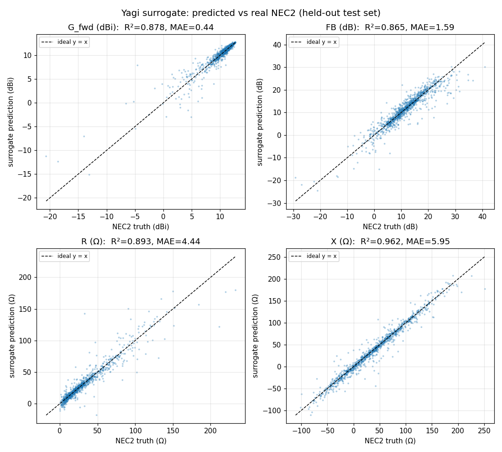

# Yagi performance surrogate model

## What this is (and what it is not)

This is a **surrogate model**: a small neural network that predicts a Yagi-Uda
antenna's performance from its 9 design parameters, trained on genuine NEC2
Method-of-Moments evaluations. It is a *fast approximation* of the real solver,
meant to give an instant estimate (intended for an interactive design preview).

It is **not** a replacement for NEC2. It interpolates real physics data; it does
not compute electromagnetics. Predictions carry real error (quantified below)
and occasionally miss badly on unusual designs. **Any value that matters should
be confirmed with a real NEC2 run** (`scripts/case_yagi.py` /
`yaf_solvers/nec2_adapter/`). The honest framing, consistent with the rest of
this project: *the surrogate accelerates exploration; the solver remains the
source of truth.*

Reproduce everything here with:

```bash
python3 scripts/train_surrogate.py
```

## Data

- **5898 real NEC2 evaluations** (converged runs) of 5-element Yagis at 300 MHz,
  each a 9-parameter design vector → `(G_fwd, F/B, R_in, X_in)`.
- Source: the differential-evolution sweep in `scripts/case_yagi.py` (seed 42),
  where every objective evaluation is a real `necpp` MoM run — no analytical
  model, no mock.
- `results/yagi_optimized.json` stores those evaluations but strips the
  per-evaluation parameter vectors to keep the file small. The training script
  therefore **reconstructs** the full `(params → performance)` records by
  re-running the same deterministic sweep; the re-run reproduces the stored
  outputs exactly (integrity check: 0 / 5898 forward-gain mismatches), so the
  reconstructed dataset is provably identical to the recorded one, only with the
  inputs recovered. The result is cached to
  `results/yagi_surrogate_dataset.npz` so later runs need neither necpp nor the
  re-run.
- **Sampling-coverage caveat:** these samples come from an optimizer, not a
  uniform sweep, so they cluster toward high-performing designs (the parameter
  bounds are still spanned — every parameter's sampled range reaches both its
  lower and upper bound — but the density is uneven). The surrogate is therefore
  most reliable near good designs and less reliable in sparsely sampled corners.

## Model

- Architecture: MLP `9 → 64 → 64 → 4`, ReLU. **5060 trainable parameters.**
- On-disk size: **~24 KB** (`models/surrogate_yagi.pt`, weights +
  normalization). The committed sidecar `models/surrogate_yagi.meta.json`
  carries the architecture, normalization statistics, and test metrics in plain
  JSON for a future browser export.
- Inputs and outputs are standardized (zero-mean / unit-variance) using
  **training-set statistics only**, so the test set sees no leakage.
- Split: 80 % train / 20 % test, with a 10 % slice of the training set held out
  as a validation set for early stopping. **All metrics below are on the
  held-out test set, which never influenced training or model selection.**

### Browser suitability

At 5060 parameters / ~24 KB, this model is trivially small for in-browser
inference (e.g. ONNX Runtime Web or a hand-written forward pass): a few thousand
multiply-adds per prediction, well under a millisecond. Size is not a concern;
accuracy is the gating factor (below).

## Accuracy (held-out test set, 1180 designs, original units)

| Target | Unit | MAE | RMSE | R² | p90 \|err\| | p95 | p99 | max | within preview band |
|---|---|---|---|---|---|---|---|---|---|
| `G_fwd` forward gain | dBi | 0.44 | 0.98 | 0.878 | 0.86 | 1.49 | 4.44 | 12.41 | **91.4 % ≤ 1 dBi** |
| `F/B` front-to-back  | dB  | 1.59 | 2.59 | 0.865 | 3.75 | 5.17 | 10.53 | 17.03 | 75.2 % ≤ 2 dB |
| `R_in` resistance    | Ω   | 4.44 | 9.01 | 0.893 | 9.17 | 15.92 | 37.53 | 109.42 | 90.7 % ≤ 10 Ω |
| `X_in` reactance     | Ω   | 5.95 | 10.40 | 0.962 | 14.05 | 21.51 | 41.20 | 87.07 | 83.9 % ≤ 10 Ω |

Scatter of predicted vs. real NEC2 on the test set:



The `max` and `p99` columns are far larger than the MAE for every target: a
small fraction of designs (unusual / sparsely sampled / near impedance
anti-resonances) are predicted badly. The median (`p50`) and `p90` errors are
the realistic picture for typical designs.

## Honest verdict: good enough for a real-time preview?

**Yes for forward gain, usable for input impedance, weakest for F/B — and never
as a final answer.**

- **Forward gain (`G_fwd`) — preview-grade.** 91 % of designs predicted within
  1 dBi, median error 0.22 dBi. Good enough to drive a live "this design gives
  roughly N dBi" readout and to rank designs while a user drags sliders.
- **Input impedance (`R_in`, `X_in`) — usable for guidance.** ~91 % of `R`
  within 10 Ω and ~84 % of `X` within 10 Ω. Fine for a coarse "roughly matched
  to 50 Ω or not" indicator; not precise enough for matching-network design.
- **Front-to-back ratio (`F/B`) — weakest, show with a caveat.** Only 75 %
  within 2 dB and a long tail (p99 ≈ 10.5 dB). F/B is a *difference* of two
  gains and is highly sensitive, so it is the hardest quantity to approximate.
  Display it as an approximate trend, not a number to trust.
- **All targets — a screening tool, not a verifier.** The tail errors mean the
  surrogate can occasionally be very wrong on an individual design. The correct
  product pattern is: surrogate for instant feedback and ranking → real NEC2 to
  confirm any design the user wants to keep.

## Known limitations

- **Domain.** Trained only on 5-element Yagis at 300 MHz within the
  `scripts/case_yagi.py` parameter bounds. It says nothing about other element
  counts, frequencies, or antenna types.
- **Optimizer-biased sampling.** Training points cluster near good designs;
  accuracy degrades in sparsely sampled regions and would degrade further on any
  design outside the training bounds (no extrapolation guarantees).
- **Tail errors.** A few percent of designs are predicted poorly (see `p99` /
  `max`), particularly impedance near anti-resonance.
- **No uncertainty estimate.** The model returns a point prediction with no
  confidence flag, so it cannot itself tell you which predictions to distrust —
  another reason to confirm kept designs with the real solver.
- **Single-frequency, single operating point.** No bandwidth, no pattern, no
  sweep — just the four scalar metrics at the design frequency.
